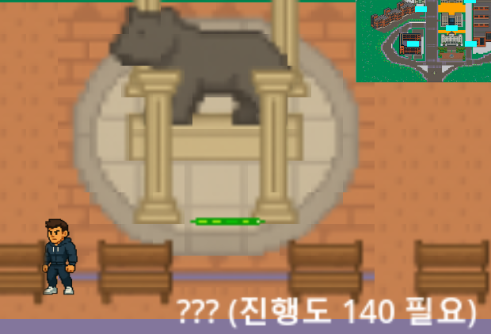

# 사용자 가이드
## List   
1. [게임 개요 및 특징](#게임-개요-및-특징)   
2. [설치 및 초기 설정](#설치-및-초기-설정)   
3. [조작법 및 게임 진행 방법](#조작법-및-게임-진행-방법)   
4. [게임 플레이 방법 및 콘텐츠 설명](#게임-플레이-방법-및-콘텐츠-설명)  

# 게임 개요 및 특징 
DKU RPG는 단국대를 배경으로 한 RPG 게임입니다. 플레이어는 캠퍼스에서 여러 전공을 대표하는 캐릭터로 활동하게 되며, 다양한 스테이지와 몬스터를 처치해 나가며 성장합니다. 익숙한 대학 생활의 요소를 RPG와 접목 시킨 독특한 설정이 특징입니다. 
 
-각각의 캐릭터는 전공에 따라 특화된 능력을 보유   
-적대 세력으로부터 캠퍼스를 수호   
-각종 요소를 통해 스펙업   

게임 목표  
-캐릭터를 성장시키고 전송 미션들을 클리어하면서 학점을 모두 채워 졸업하는 것이 주요 목표입니다.  
-각 전공별 특징이 존재하며, 클리어할수록 더 강력한 스킬과 장비를 획득할 수 있습니다.

# 설치 및 초기 설정 

### 설치 및 실행 
[Download DKU_RPG](https://github.com/jajaqyu/dkurpg )   

   
해당 깃허브 주소에서 release에 있는 dku_rpg.zip 파일을 다운 받아 압축해제한다.  
   
깃허브 소스 코드 속 db를 다운받는다.  
   
모두 한 파일에 위치시켜 exe파일을 실행하면 게임을 정상적으로 실행할 수 있다.

### 계정 생성 및 로그인
   
게임을 실행하면 로그인 화면이 나온다
  
아이디와 비밀번호를 입력 후 회원가입 버튼을 클릭하면 입력한대로 계정이 생성된다
  
계정 생성 후 로그인을 화면 캐릭터를 만들고 선택할 수 있는 화면이 나오면서 정상적으로 나오면 로그인이 된것입니다.

### 캐릭터 생성
생성 절차 
1.	빈 슬롯(+)을 클릭   
  
2.	직업 선택  
  
3.	캐릭터 이름을 입력  
  
4.	생성 버튼을 클릭하면 완료   
  

# 조작법 및 게임 진행 방법 
### 조작법
   
### 게임 진행 방법
플레이어는 스테이지를 클리어할때마다 학점으로 얻고 각 스테이지마다 고유의 스텟을 올려준다. 학점을 140학점을 채우는 동안 플레이어는 본인의 선택으로 원하는 스테이지를 클리어하면서 원하는 방향으로 스텟을 성장 시켜나갈 수 있다. 140학점을 채우게 되면 보스 스테이지에 도전할 수 있고 보스를 클리어하면 게임을 클리어하게된다.  
140학점 달성 전 
  
140학점 달성 후
 

# 게임 플레이 방법 및 콘텐츠 설명
### 아이템 시스템
DKU RPG에서는 캐릭터가 다양한 장비와 아이템을 획득하고 장착할 수 있습니다. 이 시스템은 캐릭터 능력치에 직접적인 영향을 주며, 전투력과 생존력을 높이는 핵심 요소입니다. 

장비 종류   
1.	무기: 주로 공격력을 증가
2.	방어구: 주로 방어력 증가 
3.	신발: 주로 이동 속도 증가 
4.	모자: 주로 지능 증가

장비 획득 방법
1.	몬스터들을 처치할때마다 일정 확률로 아이템을 뽑을 수 있는 뽑기권을 획득 
2.	해당 뽑기권으로 장비가 랜덤으로 나오는 뽑기를 돌려 획득 가능 
3.	미니게임 성공 시 등급 높은 장비 확률 증가  
   

장비 착용 방법  
플레이어는 장비 종류 각각 하나씩 착용 가능하다. 장비를 획득시에 얻은 장비를 착용할지 버릴지 선택 가능하며 기존에 착용하고 있던 장비가 있을 때 새로운 장비를 착용하는 경우 기존 장비는 사라진다.  
  

## 게임 UI
DKU RPG의 UI는 누구나 쉽게 플레이할 수 있도록 직곽적이고 기능별로 구분된 인터페이스를 제공합니다. 주요 UI는 게임 진행, 캐릭터 상태, 아이템 장착 등 핵심 시능과 직접 연결되어 있습니다.

### 메인 화면 UI
1.	화면 좌상단: 현재 캐릭터의 상태를 표시하는 UI로 체력, 공격력, 방어력, 지능, 이동속도, 뽑기 아이템 개수, 학점 상태를 표시한다
2.	화면 우상단: 맵을 나타내는 미니맵으로 캐릭터의 위치와 포탈들의 위치를 한눈에 파악하기 쉽다 
3.	화면 중앙: 게임 월드로서 캐릭터, 포탈, 몬스터, 맵 등 주요 모습들이 보인다 
4.	우측 하단: 여러 정보를 확인할 수 있는 단축기를 표시하여 플레이어가 아이템 정보, 직업 정보, 게임 설명을 확인할수있도록 돕는다  
  

### 주요 UI 설명
1.	캐릭터 상태 표시: 체력, 방어력, 이동속도, 공격력 등을 표시하며 피해를 입거나 장비를 착용시 수치 변경이 즉시 반영된다  
   
2.	장비창: 장비창을 통해 현재 착용 중인 장비들의 능력치와 설명, 모습을 확인 가능하며 새로운 장비를 얻을 경우 기존 장비와 수치 비교를 통해 무엇이 더 나은 선택인지 판단 가능   
  
3.	전투: 스킬 사용시 스킬 이펙트가 보여 직곽적으로 확인 가능 
  
4.	외형: 직업별 외형과 스킬 아이콘이 다르게 표시되어 몰입감 상승

### 스테이지 
스테이지1: 소프트웨어를 배경으로 하는 스테이지로 초록색 슬라임이 적으로 등장하며 클리어시 공격력 증가    
  
스테이지2: 체육학과를 배경으로 하는 스테이지로 노란색 슬라임이 적으로 등장하며 클리어시 이동속도 증가  
  
스테이지3: 건축학과를 배경으로 하는 스테이지로 파란색 슬라임이 적으로 등장하며 클리어시 방어력 증가  
  
스테이지4: 법학과를 배경으로 하는 스테이지로 빨간색 슬라임이 적으로 등장하며 클리어시 지능 증가  
  
스테이지5: 아이템 뽑기와 미니게임을 할 수 있는 스테이지
BOSS: 보스와 싸울수있는 스테이지로 보스를 물리치고 클리어시 게임의 엔딩을 보게된다  
  

### 캐릭터
게임에는 총 4개의 직업이 존재하며, 각 직업은 고유한 능력치와 스킬을 보유하고 있습니다.
1.	SW: 소프트웨어학과로 노트북을 들고 다니며 노트북을 무기처럼 사용하는 캐릭터입니다. 지능(INT) 능력치가 높아질수록 공격 스킬이 강해지는 특징이 있습니다.
2.	LAW: 법학과 캐릭터로 법전을 들고 다니며 법전을 무기처럼 사용하는 캐릭터입니다. 공격력(ATK) 능력치가 높아질수록 원거리 공격이 가능해지며 그 공격이 더욱 강해지는 특징이 있습니다.
3.	PHY: 체육학과 캐릭터로 뛰어난 신체를 바탕으로 무기 없이 직접 싸우는 캐릭터입니다. 이동속도(MOV) 능력치가 높아질수록 대시 스킬이 생기고 후에는 대시로 공격하는 것도 가능해진다는 특징이 있습니다.
4.	ARCH: 건축학과 캐릭터로 평소에는 도면을 가지고 다니지만 공격할 때는 삼각자로 공격을하는 캐릭터입니다. 방어력(DEF) 능력치가 높아질수록 자신에게 힐을 하거나 베리어를 공격을 막는 스킬이 생긴다는 특징이 있습니다.  
게임을 진행 중에 직업 변경은 불가능하며, 캐릭터를 새로 생성하여 다른 직업을 플레이할 수 있습니다.

## 미니게임
미니게임은 스테이지5에서 플레이 가능하며 클리어할 경우 아이템뽑기에서 높은 등급의 아이템 확률을 증가 시키는 효과를 준준다
### 타자게임
지정된 문장을 제한 시간 안에 정확히 입력해야한다.  
  
### 간단한 퀴즈
화면에 나오는 문제의 정답을 골라야한다.  
  